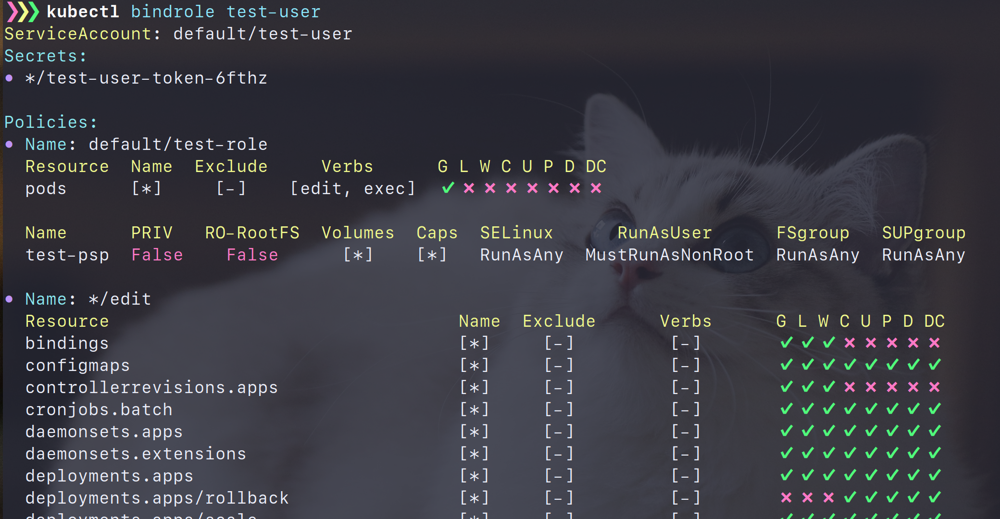

# kubectl-rolesum

Summarize RBAC roles for the specified subject (ServiceAccount, User and Group).

:warning: **kubectl-bindrole is renamed to kubectl-rolesum.**



## Installation

### for macOS

rolesum supports [homebrew](https://docs.brew.sh/Installation) :beer:

```
brew install Ladicle/kubectl-bindrole/kubectl-rolesum
```

### for other devices

The easiest way is to download binary from the [release page](https://github.com/Ladicle/kubectl-rolesum/releases).
You can also download this repository and install it using Makefile.

## Usage

```bash
$ kubectl rolesum -h  # or kubectl-rolesum -h
Summarize RBAC roles for the specified subject

Usage:
  kubectl rolesum [options] <SubjectName>

Examples:
  # Summarize roles bound to the "ci-bot" ServiceAccount.
  kubectl rolesum ci-bot

  # Summarize roles bound to the "developer" Group.
  kubectl rolesum -k Group developer

SubjectKinds:
  - ServiceAccount (default)
  - User
  - Group

Options:
  -h, --help                   Display this help message
  -n, --namespace string       Change the namespace scope for this CLI request
  -k, --subject-kind string    Set SubjectKind to summarize (default: ServiceAccount)
  -o, --options                List of all options for this command
      --version                Show version for this command

Use "kubectl rolesum --options" for a list of all options (applies to this command).
```

This command supports both kubectl-plugin mode and standalone mode.
